# OJ前后端开发需求


## 开发计划2020_09 - 2020_12

- [x] 1、学生在提交错误代码后可以手动标注错误类型

- [x] 2、如果点击已经标注过错误类型，下次点击时会显示错误类型

- [x] 3、为每个contest考试设置隐藏测试用例选项（涉及到的model有contest和submission）

  * 例如在下图管理员contest list页面加一列按钮，是否显示测试用例

    

  

### q2:

  目前已实现,实现方案:
  新增api用于查询某个submission的tags返回给前端
path:submission/urls/oj.py:

```java
url(r"^getAnnotationError/?$", getErrorAnnotationAPI.as_view(), name="getErrorAnnotation_api")
```
path:submission/views/oj.py:
```java
class getErrorAnnotationAPI(APIView):
    def get(self, request):
        if not request.GET.get("id"):
            return self.error("submissionId is needed")
        try:
            submission = Submission.objects.get(id=request.GET.get("id"))
        except Submission.DoesNotExist:
            return self.error("submission does not exist")
        res_tags = []
        for e in submission.tags.all():
            res_tags.append(SubmissionTagSerializer(e).data)
        return self.success(res_tags)
```
其中没有添加需要登录的注解,根据需要进行添加

前端根据返回的tags数组是否为空来判断这个submission是否已经标注,从而显示不同的模态框
已标注:
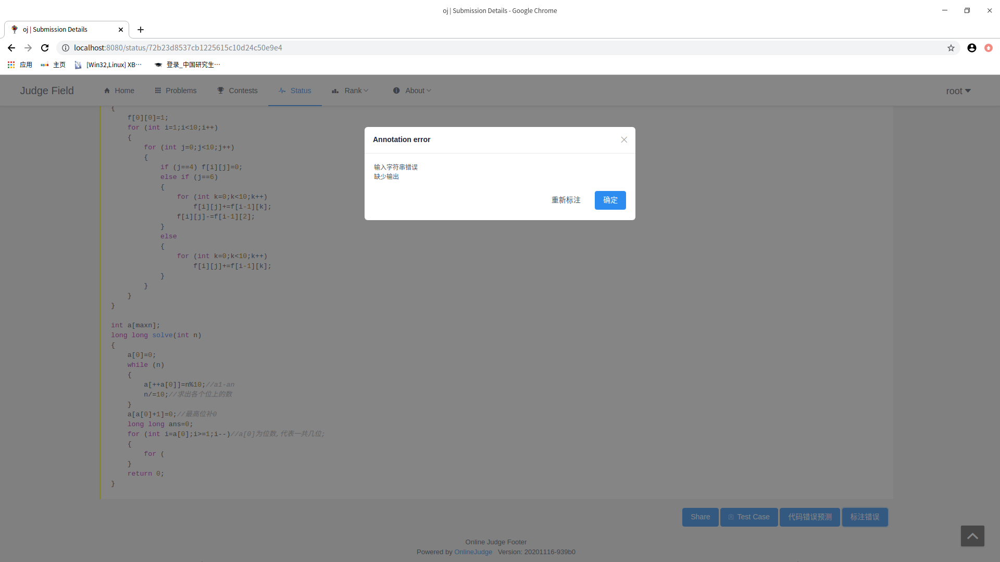
可以点击重新标注打开另外一个标注错误的模态框:


### q3:

contest/models 添加show_case字段:
```java
show_case = models.BooleanField(default=True)
```

对测试样例的隐藏实现:
```java
class TestCaseAPI(CSRFExemptAPIView, TestCaseZipProcessor):
    request_parsers = ()

    def get(self, request):
        problem_id = request.GET.get("problem_id")
        if not problem_id:
            return self.error("Parameter error, problem_id is required")
        try:
            problem = Problem.objects.get(id=problem_id)
        except Problem.DoesNotExist:
            return self.error("Problem does not exists")
        if not ((request.user.is_authenticated and request.user.is_admin_role()) or problem.contest is None):
            return self.error("You are not granted")
```

以上是样例下载api的代码,其中
```javascript
if not ((request.user.is_authenticated and request.user.is_admin_role()) or problem.contest is None):
            return self.error("You are not granted")
```
之前控制的是管理员或者题目不是比赛的题目才能下载,现在需要对它添加一个如果题目是比赛的题目且这个比赛设置了开放样例,那么也可以下载

改为
```javascript
        if problem.contest is not None:
            if not problem.contest.show_case and request.user.is_authenticated and request.user.is_admin_role():
                return self.error("You are not granted")
```

效果:

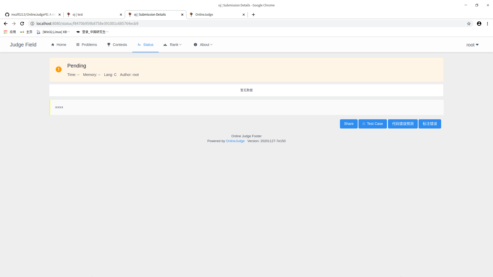
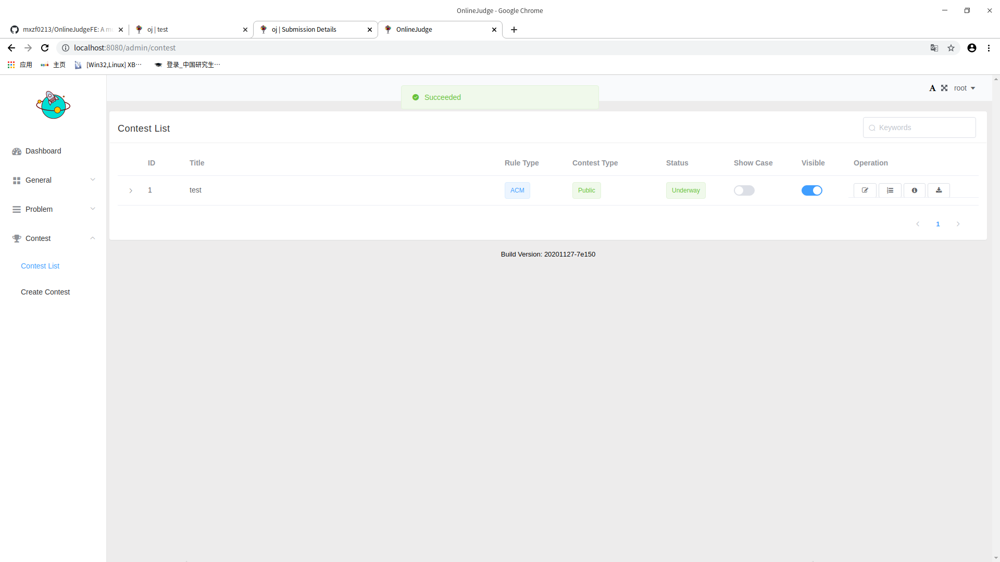
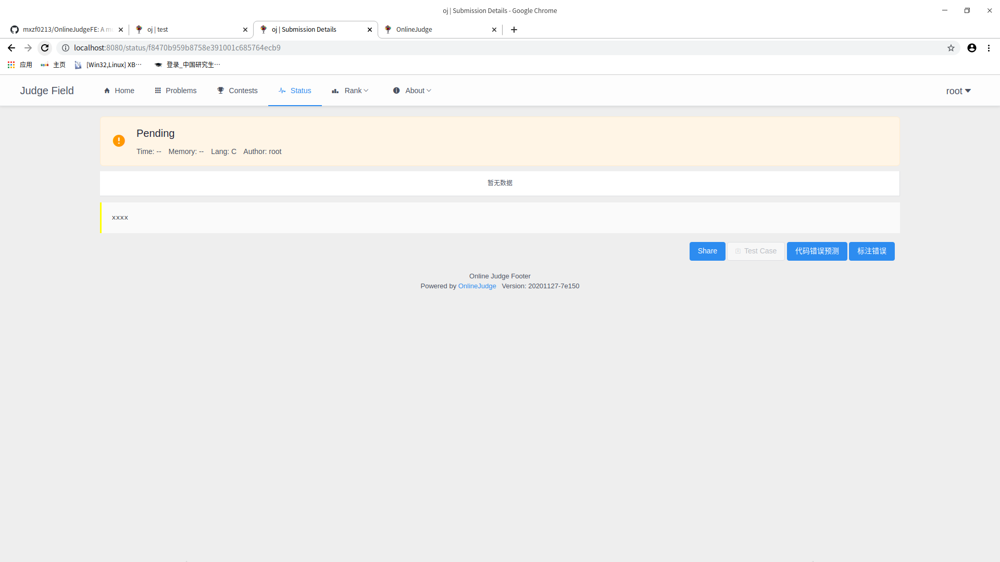


### q3修改：

前端目录src/pages/oj/views/submission/SubmissionDetails.Vue：


show_case或者管理员控制测试用例的下拉框显示与否（数据控制在后端，这里只修改下拉框显示）


后端目录submission/views/oj.py：

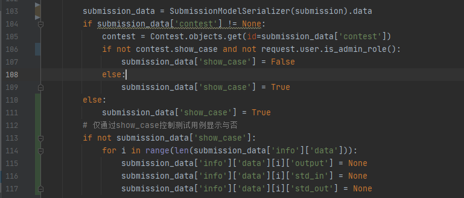

show_case或者管理员能够从后端获取到测试用例数据


效果：

普通用户应能够看到并下载contest 20的测试用例，但是看不到contest 21的（任何情况下管理员应该都能看到测试用例）


普通用户查看自己在contest 20的一个提交记录：

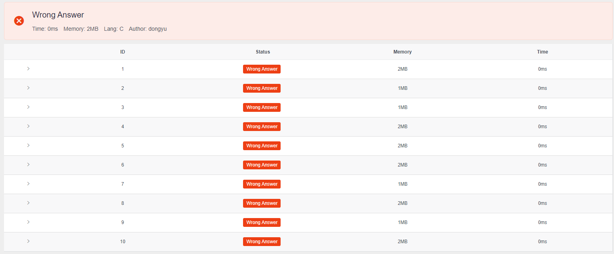

普通用户查看自己在contest 21的一个提交记录：

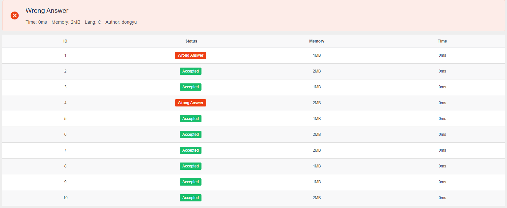


## 开发计划2021_01 - 2020_02

- [ ] 1、每个通过（即AC）的提交记录显示提交用时和使用内存的两个分布图（参考leetcode提交记录）
- [ ] 2、添加代码补全（vue的编辑器应该有类似插件），格式调整（如缩进应该是4空格等，预计是修改现有编辑器参数设置）
- [ ] 3、编辑器在提交代码前有运行测试用例这样一个选项，以减少因为本地（如windows）和服务器系统（linux）环境的不同而导致的样例不能通过的问题（此类问题上课时同学反映较多），这种先测选项不记录数据库提交记录
- [ ] 4、解题思路区（只提供题解和代码，可以加入点赞和点踩选项），讨论区（形式较多，可以提供题解，代码，点赞，点踩，楼层回复等）

#### d2q1
铺垫:添加题目列表页和题目详情页中的历史提交标签:
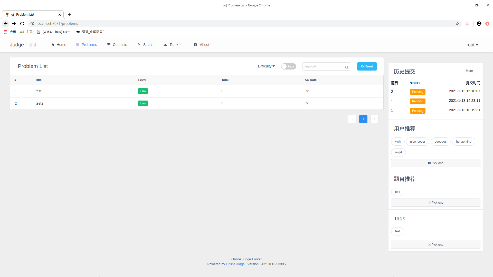

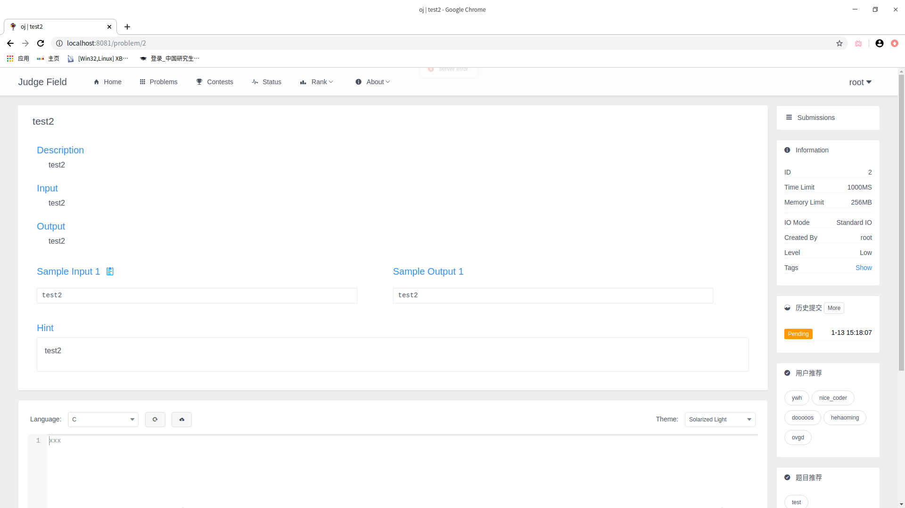

点击某个提交后会跳转至具体的status页面:
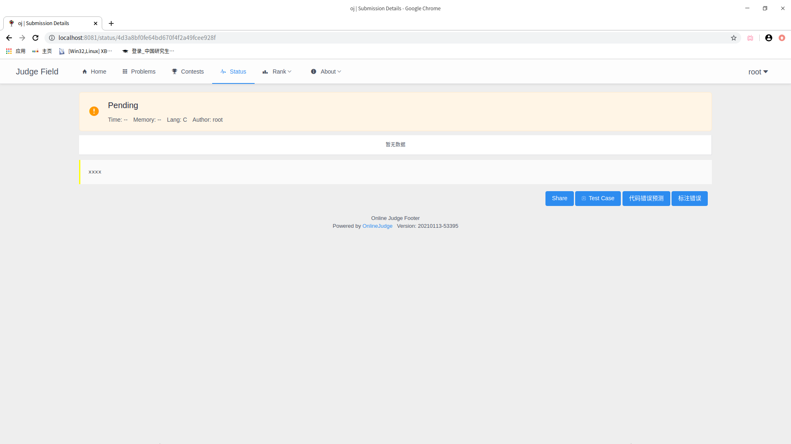

题目列表页more按钮跳转路由:
url参数:self=1&username=xxx
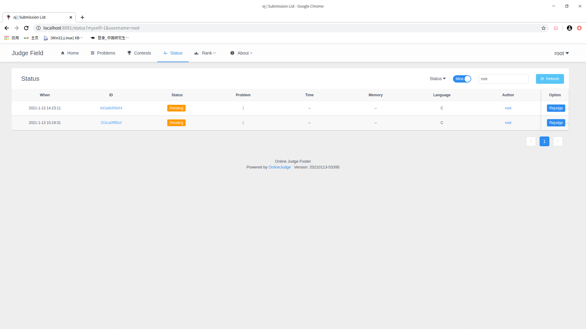

题目详情页more按钮跳转路由:
url参数:self=1&username=xxx&problemID=yy
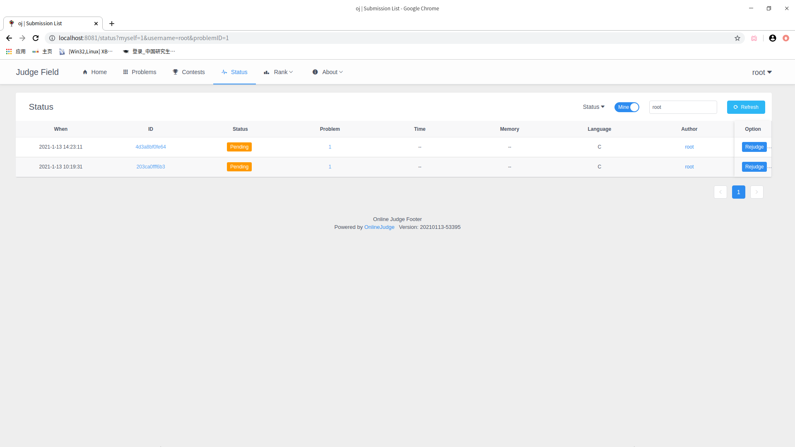

#### d2q2:
考虑下
[Monaco Editor](https://microsoft.github.io/monaco-editor/monarch.html)