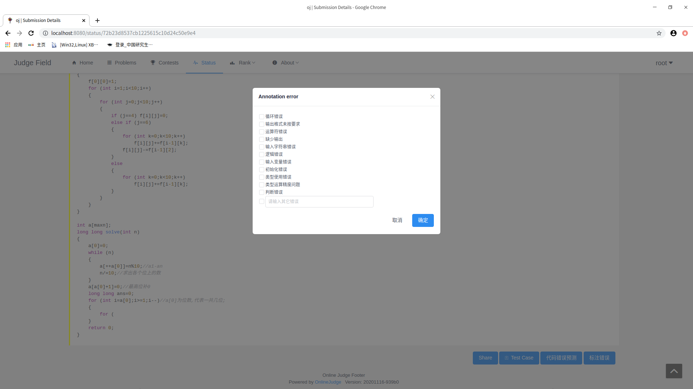
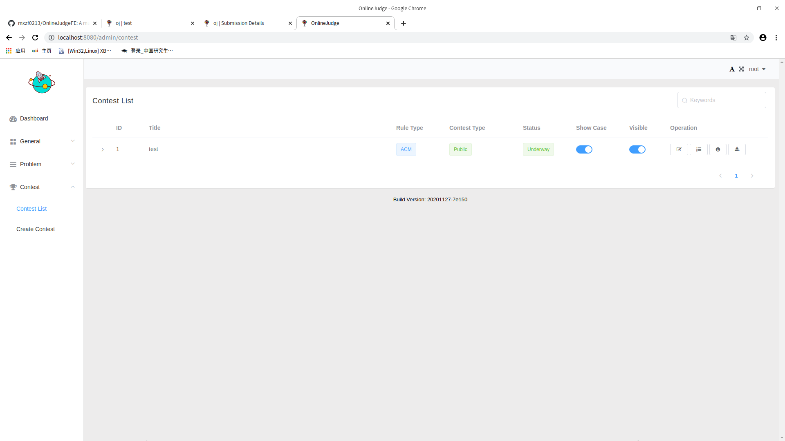

## OJ前后端开发需求

- [x] 1、学生在提交错误代码后可以手动标注错误类型

- [x] 2、如果点击已经标注过错误类型，下次点击时会显示错误类型

- [x] 3、为每个contest考试设置隐藏测试用例选项（涉及到的model有contest和submission）

  * 例如在下图管理员contest list页面加一列按钮，是否显示测试用例

    

  
q2:
  目前已实现,实现方案:
  新增api用于查询某个submission的tags返回给前端
path:submission/urls/oj.py:
```java
url(r"^getAnnotationError/?$", getErrorAnnotationAPI.as_view(), name="getErrorAnnotation_api")
```
path:submission/views/oj.py:
```java
class getErrorAnnotationAPI(APIView):
    def get(self, request):
        if not request.GET.get("id"):
            return self.error("submissionId is needed")
        try:
            submission = Submission.objects.get(id=request.GET.get("id"))
        except Submission.DoesNotExist:
            return self.error("submission does not exist")
        res_tags = []
        for e in submission.tags.all():
            res_tags.append(SubmissionTagSerializer(e).data)
        return self.success(res_tags)
```
其中没有添加需要登录的注解,根据需要进行添加

前端根据返回的tags数组是否为空来判断这个submission是否已经标注,从而显示不同的模态框
已标注:

可以点击重新标注打开另外一个标注错误的模态框:



q3:

contest/models 添加show_case字段:
```java
show_case = models.BooleanField(default=True)
```

对测试样例的隐藏实现:
```java
class TestCaseAPI(CSRFExemptAPIView, TestCaseZipProcessor):
    request_parsers = ()

    def get(self, request):
        problem_id = request.GET.get("problem_id")
        if not problem_id:
            return self.error("Parameter error, problem_id is required")
        try:
            problem = Problem.objects.get(id=problem_id)
        except Problem.DoesNotExist:
            return self.error("Problem does not exists")
        if not ((request.user.is_authenticated and request.user.is_admin_role()) or problem.contest is None):
            return self.error("You are not granted")
```

以上是样例下载api的代码,其中
```javascript
if not ((request.user.is_authenticated and request.user.is_admin_role()) or problem.contest is None):
            return self.error("You are not granted")
```
之前控制的是管理员或者题目不是比赛的题目才能下载,现在需要对它添加一个如果题目是比赛的题目且这个比赛设置了开放样例,那么也可以下载

改为
```javascript
        if problem.contest is not None:
            if not problem.contest.show_case and request.user.is_authenticated and request.user.is_admin_role():
                return self.error("You are not granted")
```

效果:



